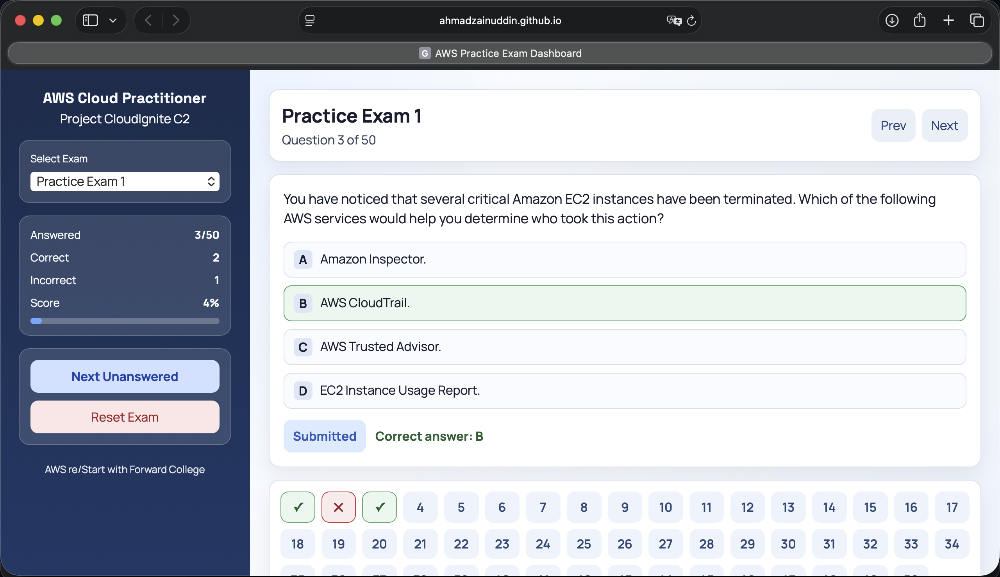

<div align="center">

# AWS Cloud Practitioner Exam Prep

**Professional AWS Cloud Practitioner practice exam dashboard using Vue.js, Vite, and static JSON exam data.**


[GitHub Pages](https://ahmadzainuddin.github.io/AWS-Cloud-Practitioner-Exam-Prep/) · [Cloudflare Pages](https://aws-cloud-practitioner-exam-prep.pages.dev/) · [Repository](https://github.com/ahmadzainuddin/AWS-Cloud-Practitioner-Exam-Prep)

</div>

## Overview

AWS Cloud Practitioner Exam Prep is a Vue-based practice exam dashboard for AWS Cloud Practitioner revision. The application serves multiple-choice exams from static JSON, tracks progress in the browser, and publishes automatically to GitHub Pages.

The dashboard is designed for focused exam practice. Users can select an exam, move between questions, submit answers, review the correct answer, and track score and completion progress without needing a backend service.

## Screenshot



## Disclaimer

This project is an educational practice tool created for AWS Cloud Practitioner exam revision. It is not an official AWS product, training platform, certification provider, or exam simulator.

AWS, AWS Cloud Practitioner, and related service names are trademarks of Amazon Web Services, Inc. or its affiliates. The questions and explanations in this project should be used as study support only. Users should always refer to official AWS documentation, AWS Skill Builder, and the latest certification exam guide for authoritative information.

## Dataset

Current dataset:

- 12 practice exams
- 591 answerable questions
- 0 questions with empty answer arrays
- Exams without answerable questions have been removed from the published dataset

## Features

- Exam selector for available practice exams
- Randomized question order saved per exam in browser cookies
- Question navigation with previous and next controls
- Single-answer and multi-answer question support
- Correct and incorrect answer highlighting after submission
- Per-exam score, answered count, correct count, and incorrect count
- Question navigator showing answered, correct, and incorrect status
- Cookie-based progress persistence
- Static deployment through GitHub Pages

## Tech Stack

- Vue 3
- Vite
- JavaScript
- CSS
- GitHub Actions
- GitHub Pages

## Getting Started

Install dependencies:

```bash
npm install
```

Start the local development server:

```bash
npm run dev
```

Build for production:

```bash
npm run build
```

Preview the production build:

```bash
npm run preview
```

## Data Source

The application loads exam data from:

```text
public/practice-exams.json
```

This is the single source of truth for the published exam dataset. Vite serves it as a public static asset at runtime.

Each exam uses this structure:

```json
{
  "source_file": "practice-exam-1.md",
  "title": "Practice Exam 1",
  "question_count": 50,
  "questions": [
    {
      "number": 1,
      "question": "Question text",
      "options": [
        { "key": "A", "text": "Option A" },
        { "key": "B", "text": "Option B" }
      ],
      "answer": ["A"]
    }
  ]
}
```

Data quality rules:

- `questions` must not be empty for any published exam.
- Every question must have a non-empty `answer` array.
- `answer` values must match option keys.
- Multi-answer questions should use multiple keys, for example `["A", "D"]`.
- `question_count` must match the final `questions.length`.

## Progress Storage

Progress is stored in a browser cookie named:

```text
aws_mcq_dashboard_state
```

The cookie stores selected exam index, current question index, selected answers, submitted questions, and randomized question order per exam. It is scoped to the site path and expires after one year.

When an exam is opened for the first time and no saved question order exists, the app reads questions from `public/practice-exams.json`, randomizes them, and saves the randomized order in the cookie. If the order already exists, the app reuses it instead of randomizing again. Resetting an exam clears that exam's saved order and creates a fresh randomized sequence.

The question navigator always displays sorted session positions, such as `1` to `50`, while the underlying question content is randomized behind those positions.

## Deployment

Deployment is handled by GitHub Actions:

```text
.github/workflows/deploy.yml
```

The workflow runs on every push to `main` and performs:

1. Checkout
2. Node.js setup
3. Dependency installation
4. Production build
5. GitHub Pages artifact upload
6. GitHub Pages deployment

## Maintenance Notes

- Do not commit `node_modules/` or `dist/`; both are ignored.
- Keep `package-lock.json` committed for reproducible dependency installs.
- Validate data changes with `npm run build` before publishing.
- If new exam data is imported from Markdown, verify that numbered lists and `Correct Answer:` blocks are parsed correctly before replacing JSON.

## Author

Developed by Ahmad Zainuddin.

BSc (Hons) Information Technology candidate at Malaysia University of Science and Technology (MUST), with interests in data science, cloud computing, fintech systems, and financial analytics.

This project demonstrates a browser-based AWS Cloud Practitioner practice exam dashboard using Vue.js, Vite, static JSON datasets, cookie-based progress tracking, and GitHub Pages deployment.

Areas of interest: financial analytics, cloud computing, fintech systems, data visualization, and AI-assisted applications.

Relevant coursework:

- Data Science
- Business Analytics & Artificial Intelligence
- Applied Statistics
- Object-Oriented Analysis & Design
- System Analysis and Design
- Software Engineering
- Data Structures & Algorithms

GitHub: [@ahmadzainuddin](https://github.com/ahmadzainuddin)

Email: [zainuddin@codemaster.my](mailto:zainuddin@codemaster.my)

Project: AWS Cloud Practitioner Exam Prep

Live Demo: [aws-cloud-practitioner-exam-prep.pages.dev](https://aws-cloud-practitioner-exam-prep.pages.dev/)

GitHub Pages: [ahmadzainuddin.github.io/AWS-Cloud-Practitioner-Exam-Prep](https://ahmadzainuddin.github.io/AWS-Cloud-Practitioner-Exam-Prep/)

## License

This project is licensed under the MIT License.
